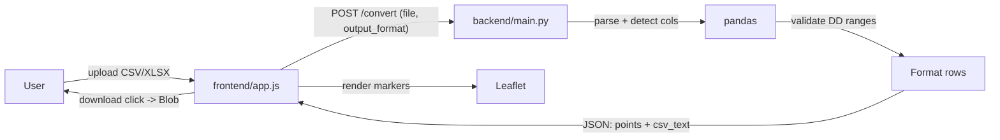

# CoordClean v1 Backend

## Scope

v1 = a working end-to-end local app. Input is always **decimal degrees** (CSV or XLSX). Output is either **decimal degrees** or **degrees/minutes/seconds**, chosen via the existing dropdown. The Leaflet map preview always shows DD points (since Leaflet needs numeric DD).

Out of scope for v1: DMS input parsing, true CRS reprojection, auth, cloud deployment, persistent storage.

## Request flow



## Project layout (additions only)

```
CoordClean-Web/
  backend/
    main.py              # FastAPI app, /convert endpoint, conversion + parsing
    requirements.txt
  frontend/              # existing, minor JS edit
  README.md              # updated with run instructions
```

Keep everything in a single `backend/main.py` for the MVP (per the "no unnecessary helpers / incremental" rules). Split later if it grows.

## Backend: `backend/main.py`

One FastAPI app, one endpoint.

- `POST /convert` — accepts `multipart/form-data` with:
  - `file`: CSV or XLSX
  - `output_format`: `"dd"` or `"dms"`
- Returns JSON:

```json
{
  "points": [{ "lat": 46.5854, "lon": -112.0185, "label": "Montana State Capitol" }],
  "csv_text": "Name,Lat,Long\nMontana State Capitol,46°35'07.50\"N,112°01'06.45\"W\n...",
  "filename": "helena_points_dms.csv",
  "row_count": 10
}
```

Key behaviors:
- **Column detection** (case-insensitive): lat ∈ {`lat`, `latitude`, `y`}; lon ∈ {`lon`, `long`, `lng`, `longitude`, `x`}; optional label ∈ {`name`, `label`, `id`}.
- **Parsing**: pandas — `read_csv` for `.csv`, `read_excel` for `.xlsx` (openpyxl engine).
- **Validation**: reject if columns can't be detected, file > 5 MB, rows where lat ∉ [-90, 90] or lon ∉ [-180, 180].
- **DMS formatter**: convert a signed decimal to `DD°MM'SS.SS"H` (H = N/S or E/W). One small inline function — no separate module.
- **CSV output**: build via `pandas.DataFrame.to_csv(index=False)` so the user can re-download a cleaned, normalized file even when output is `dd`.
- **Errors**: return 400 with `{ "detail": "..." }`; the existing frontend already handles non-2xx by showing the message.
- **CORS**: allow `http://localhost:*` and `http://127.0.0.1:*` so opening `frontend/index.html` directly or via `python -m http.server` both work.

## Backend: `backend/requirements.txt`

Pinned, minimal:

- `fastapi`
- `uvicorn[standard]`
- `python-multipart`  (required by FastAPI for file uploads)
- `pandas`
- `openpyxl`  (XLSX engine)

Pinned to current stable versions when writing the file.

## Frontend: small wire-up in `frontend/app.js`

Only the Download button needs work. The convert handler already POSTs the right payload and renders `data.points`. Two small edits:

- After a successful `/convert` response, store `data.csv_text` and `data.filename` in module-scope vars.
- Replace the placeholder in [frontend/app.js](frontend/app.js) lines 90–92:

```90:92:frontend/app.js
downloadBtn.addEventListener("click", () => {
  setStatus("Download will be wired to the backend response.", "info");
});
```

…with a real handler that turns `csv_text` into a `Blob` and triggers an `<a download>` click. No new libraries.

Also remove the `MOCK_POINTS` fallback path (lines 18–24, 79) once the backend is in place — keeping it hides real backend errors. Replace with a clear error status.

## README updates

Add a "Run locally" section to the root [README.md](README.md):

1. `cd backend && python -m venv .venv && .venv\Scripts\activate && pip install -r requirements.txt`
2. `uvicorn main:app --reload --port 8000`
3. In another terminal: `cd frontend && python -m http.server 5500`
4. Open `http://localhost:5500` and upload `helena_points.csv`.

## Manual test (using existing sample files)

- Upload `helena_points.csv` with output `dd` → 10 markers around Helena, downloaded CSV identical schema.
- Upload `helena_points.xlsx` with output `dms` → same 10 markers, downloaded CSV has values like `46°35'07.50"N`.
- Upload a file missing a `Lat` column → red error status with backend's 400 message.
