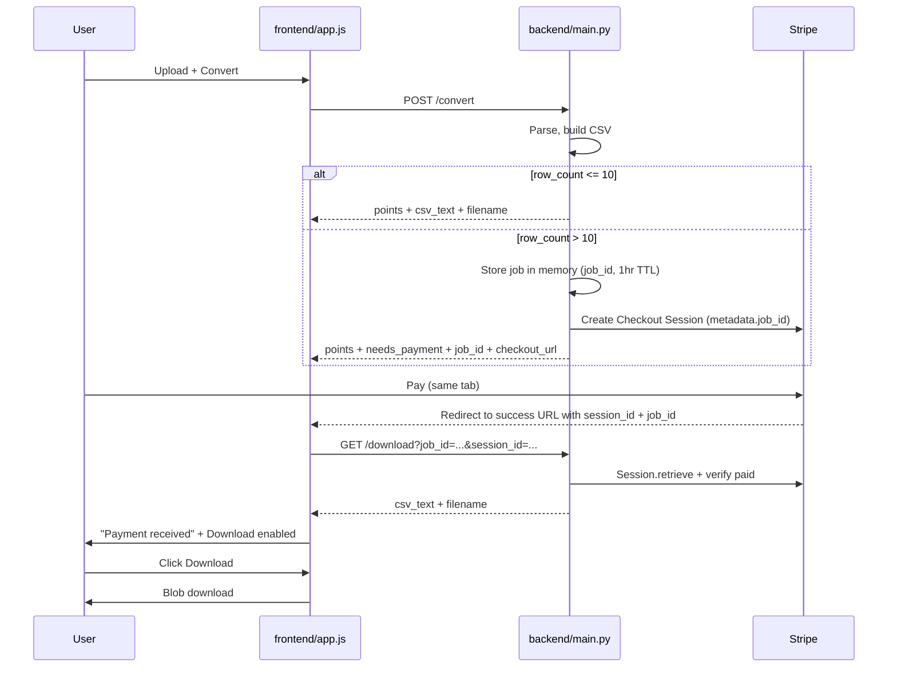

# Coordly v1.3 — Full Stripe Paywall

## Goal

Replace the current **static Payment Link** (frontend-only gate) with a **server-enforced paywall**:

- Map preview stays free for all row counts.
- `csv_text` is **never returned** from `/convert` when `row_count > 10`.
- User pays via **Stripe Checkout** (dynamic session per conversion).
- After redirect, backend **verifies** `session_id` with Stripe before releasing the CSV via `GET /download`.

Post-payment UX (confirmed): show **"Payment received"**, enable **Download** — user clicks once to save the file.

## Local URLs (your setup)

| Role | URL |
|---|---|
| Frontend | `http://127.0.0.1:5500/frontend/` |
| Backend | `http://127.0.0.1:8000` |
| Serve frontend | From **repo root**: `python -m http.server 5500` (not from inside `frontend/`) |

**Stripe note:** The static Payment Link in [frontend/index.html](frontend/index.html) and [frontend/app.js](frontend/app.js) will be **removed**. Success/cancel URLs for the real flow are set in **backend code** when creating each Checkout Session (`success_url` / `cancel_url`). Dashboard Payment Link redirect settings do not apply to Checkout Sessions created via API.

Success URL shape (set in backend when creating session):

```
http://127.0.0.1:5500/frontend/?session_id={CHECKOUT_SESSION_ID}&job_id=<uuid>
```

Stripe auto-replaces `{CHECKOUT_SESSION_ID}`; `job_id` is appended by our code.

## Architecture



## Step-by-step implementation

### Step 1 — Prep: secrets and gitignore

**Files:** [.gitignore](.gitignore), new `backend/.env.example`

- Add `.env` to [.gitignore](.gitignore) so Stripe keys are never committed.
- Create `backend/.env.example` (committed) documenting required vars:

```
STRIPE_SECRET_KEY=sk_test_...
STRIPE_PRICE_ID=price_...
FRONTEND_BASE_URL=http://127.0.0.1:5500/frontend
FREE_ROW_LIMIT=10
```

**You do (before Step 3 backend Stripe code):**
- Stripe Dashboard → Developers → API keys → copy **test** secret key (`sk_test_...`)
- Products → copy **Price ID** (`price_...`) for your one-time product
- Paste into `backend/.env` (create locally, do not commit)

**Test:** `.env` exists locally; `git status` does not show it.

---

### Step 2 — Backend: withhold CSV + job store

**File:** [backend/main.py](backend/main.py)

Changes (no Stripe yet):

- Add `free_row_limit = 10` (read from env optional).
- Add in-memory job store: `dict[job_id → { csv_text, filename, created_at }]` with ~1 hour TTL cleanup on access.
- After building `csv_text` in `/convert`:
  - If `row_count <= free_row_limit`: return response unchanged.
  - If `row_count > free_row_limit`: save to job store, return:

```json
{
  "points": [...],
  "row_count": 11,
  "dropped_count": 0,
  "needs_payment": true,
  "job_id": "uuid",
  "checkout_url": null
}
```

  - **Omit** `csv_text` and `filename` entirely for paid tier.

**Test (Swagger or curl):**
- `helena_points.csv` (10 rows) → response includes `csv_text`.
- `helena_points_11.csv` → response has `needs_payment: true`, `job_id`, **no** `csv_text`.
- DevTools Network tab: confirm CSV is not leaked for 11-row file.

---

### Step 3 — Backend: Stripe Checkout + download endpoint

**Files:** [backend/main.py](backend/main.py), [backend/requirements.txt](backend/requirements.txt)

- Add `stripe` and `python-dotenv` to [backend/requirements.txt](backend/requirements.txt).
- Load env at startup (`load_dotenv()`).
- When `needs_payment`, call `stripe.checkout.Session.create()`:
  - `mode="payment"`
  - `line_items=[{"price": STRIPE_PRICE_ID, "quantity": 1}]`
  - `metadata={"job_id": job_id}`
  - `success_url=f"{FRONTEND_BASE_URL}/?session_id={{CHECKOUT_SESSION_ID}}&job_id={job_id}"`
  - `cancel_url=f"{FRONTEND_BASE_URL}/?cancelled=1"`
- Return `checkout_url` from session in `/convert` response.

New endpoint:

```
GET /download?job_id=<uuid>&session_id=cs_test_...
```

- Retrieve session via Stripe API.
- Verify: `payment_status == "paid"` AND `metadata.job_id == job_id`.
- Look up job in store; return `{ csv_text, filename }` or 402/404 with `{ detail }`.

**Test:**
- Convert 11-row file → copy `checkout_url` from response → open in browser → pay with test card `4242 4242 4242 4242`.
- After redirect, copy `session_id` and `job_id` from URL → call `GET /download` in Swagger → receive CSV.

---

### Step 4 — Backend: CORS for your frontend origin

**File:** [backend/main.py](backend/main.py)

Current regex already allows `http://127.0.0.1:5500`. Verify it still works when frontend is at `/frontend/` path (CORS uses origin only — path does not matter). No change expected unless you hit CORS errors in Step 5.

**Test:** Browser console shows no CORS errors on `/convert` and `/download`.

---

### Step 5 — Frontend: wire full payment flow

**Files:** [frontend/app.js](frontend/app.js), [frontend/index.html](frontend/index.html)

Remove:
- `stripePaymentUrl` constant and static Payment Link `href` / `target="_blank"`.

Add:
- `backendDownloadUrl = "http://127.0.0.1:8000/download"`
- State: `lastJobId`, `paymentComplete` flag.
- On convert success:
  - If `data.needs_payment`: show paywall, store `lastJobId`, **do not** set `lastCsvText`; wire Pay button to `window.location.href = data.checkout_url` (same tab).
  - Else: existing free-tier flow (`lastCsvText`, hide paywall, enable download).
- On page load (`handlePaymentReturn()`):
  - Parse `session_id` and `job_id` from URL query string.
  - If present: `fetch(backendDownloadUrl + "?job_id=...&session_id=...")`.
  - On success: set `lastCsvText`, `lastFilename`, `paymentComplete = true`, hide paywall, enable download, `setStatus("Payment received. You can download your file.", "success")`.
  - Clean URL with `history.replaceState` (remove query params).
  - If `cancelled=1`: show info message, keep paywall if user had converted before leaving.
- Download handler: allow download when paywall hidden OR `paymentComplete`; block when unpaid + paywall visible.

**Test (partial, before full E2E):**
- 10-row file: convert + download works, no paywall.
- 11-row file: paywall shows, Download disabled, Pay redirects to Stripe.

---

### Step 6 — End-to-end manual test matrix

| Case | Expected |
|---|---|
| `helena_points.csv` (10 rows) | Free convert + download, no Stripe |
| `helena_points_11.csv` | Map shows 11 markers, paywall visible, no `csv_text` in Network |
| Pay with test card | Redirect to `/frontend/?session_id=...&job_id=...` |
| After redirect | "Payment received", Download enabled |
| Click Download | CSV saves with correct DMS/DD format |
| Cancel on Stripe | Returns with `cancelled=1`, download still blocked |
| Re-open success URL | `/download` still works (idempotent) or graceful message if job expired |

---

### Step 7 — README update

**File:** [README.md](README.md)

Add v1.3 sections:
- Run backend with `.env`
- Run frontend from repo root on port 5500
- Stripe test mode setup
- Free tier: 10 rows
- Tag `v1.3.0` when stable

## Known v1.3 limits (document, fix later)

- Job store is **in-memory** — uvicorn restart loses pending jobs; user re-converts.
- **No webhook** — relies on success redirect; add `checkout.session.completed` webhook before production.
- **No rate limiting** on `/convert`.
- Deploying to Render + Hostinger requires updating `FRONTEND_BASE_URL` and CORS for production domain.

## Files touched (summary)

| File | Changes |
|---|---|
| [backend/main.py](backend/main.py) | Job store, paywall branch in `/convert`, Stripe session, `GET /download` |
| [backend/requirements.txt](backend/requirements.txt) | `stripe`, `python-dotenv` |
| [backend/.env.example](backend/.env.example) | New — env template |
| [.gitignore](.gitignore) | Add `.env` |
| [frontend/app.js](frontend/app.js) | Checkout redirect, return handler, download unlock |
| [frontend/index.html](frontend/index.html) | Remove static Stripe link attrs |
| [README.md](README.md) | Run + Stripe test instructions |
