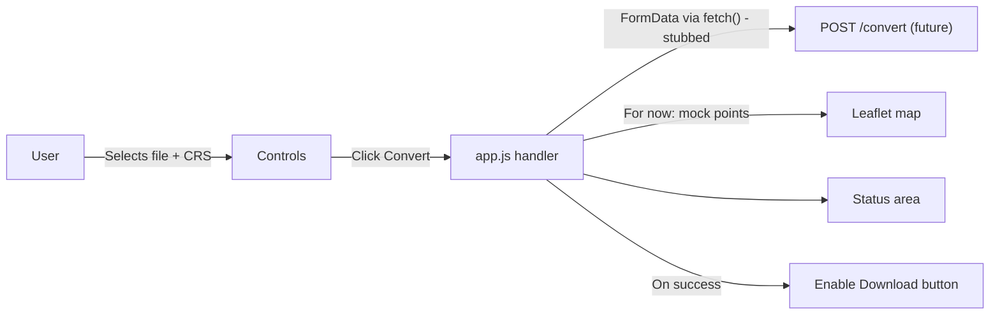

## Layout

A single-page app with two regions:

- **Left/top: Controls panel** — title, file input, input CRS dropdown, output CRS dropdown, Convert button, Download Cleaned CSV button (disabled), status/messages area.
- **Right/bottom: Map panel** — full-height Leaflet map.

On wide screens it's a two-column grid; on narrow screens it stacks.

## Files to create

### 1. [frontend/index.html](frontend/index.html)

- Standard HTML5 boilerplate.
- Link Leaflet CSS + JS from the official CDN (`unpkg.com/leaflet@1.9.4/...`).
- Link `style.css` and `app.js` (deferred).
- Header with app name "CoordClean" and a one-line tagline.
- `<section class="controls">` containing:
  - `<input type="file" id="fileInput" accept=".csv,.xlsx">`
  - `<select id="inputCrs">` and `<select id="outputCrs">` with two options each:
    - `WGS84 Lat/Lon (EPSG:4326)` value `EPSG:4326`
    - `Web Mercator (EPSG:3857)` value `EPSG:3857`
  - `<button id="convertBtn">Convert</button>`
  - `<button id="downloadBtn" disabled>Download Cleaned CSV</button>`
  - `

`
- `<section class="map">

</section>`

### 2. [frontend/style.css](frontend/style.css)

- Reset/box-sizing basics, a clean system font stack, light neutral palette.
- `body` uses CSS grid: `grid-template-columns: 360px 1fr;` with a media query collapsing to one column under ~800px.
- `#map` set to `height: 100vh` (or fills the grid cell) — required so Leaflet renders.
- Styled form controls, primary button color for Convert, muted style for disabled Download, status area with subtle background.

### 3. [frontend/app.js](frontend/app.js)

Keep it linear and beginner-readable — no classes, minimal helpers. Roughly:

- Initialize Leaflet on `#map` centered on a sensible default (e.g., `[39.5, -98.35]`, zoom 4) with the OSM tile layer.
- Grab DOM references for `fileInput`, `inputCrs`, `outputCrs`, `convertBtn`, `downloadBtn`, `status`, and keep a `markersLayer = L.layerGroup().addTo(map)`.
- A small `setStatus(message, kind)` writer that updates `#status` (kind = info/error/success controls a class).
- `convertBtn` click handler:
  1. Validate a file is selected; set status accordingly.
  2. Build `FormData` with `file`, `input_crs`, `output_crs`.
  3. `fetch('http://localhost:8000/convert', { method: 'POST', body: formData })` wrapped in `try/catch`. On any failure (expected for now, no backend), fall back to mock data and show a status like "Backend not available — showing mock preview."
  4. Define a small mock array of ~5 points (lat/lon around the US) and pass it to a `renderPoints(points)` step that clears `markersLayer`, adds markers with popups (e.g., "Row N"), and calls `map.fitBounds(...)` when there are points.
  5. Enable `downloadBtn` after a successful render. The button's click handler is a placeholder (`setStatus('Download will be wired to backend response.')`) until the real CSV blob exists.

## Notes / non-goals for V0

- No CSV/XLSX parsing in the browser — the file is forwarded to the backend as-is.
- No column-mapping UI yet (Convert assumes the backend knows which columns are coordinates).
- No build tools, no frameworks, no npm — everything via CDN and plain files.